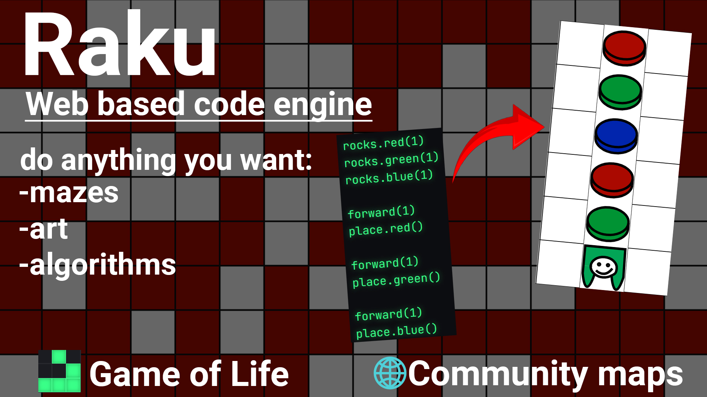

# Raku 

Raku, A game where you need to program a robot and make it through 2D mazes and make pictures :D (With red,blue and green rocks). You will need to make algorithms and sort out how to make it out.
There is `Game of Life` mode, too.

---

## Features
* Code Engine: You can program your own robot named `Raku`. There is plenty of commands
* Map editing: You can edit someone`s or your own map very easily
* Web-based: You can access this site from any OS. You can share your maps ;)  
* Conway's Game of Life: Fully implemented classical version of Game of Life
* 
---

## Code Engine 

The code engine was entirely made in vanilla JS, using `regex` for splitting the code, the user wrote.
Because of that, you can use some JS commands inside the code engine(Math.random())

---

## Map editing

Editing your map is very fun and interesting :) . You can create mazes, pixel art, etc.
Because of my database, you can even publish it later, and share it with your friends!

---

## Web-based

You can access for this site from any OS and any time B). 

---

## Game of life

You can play the classic version of Game of life! It was fully implemented, and because of previous features that I added inside Raku, you can even change the speed and the size of the map!

---
## Tech Stack
- HTML
- CSS
- vanilla JS

---
## Usage

- Download the zip file of the project
- Execute the zip file
- Open the html file inside the directory in a browser(for example Firefox)
